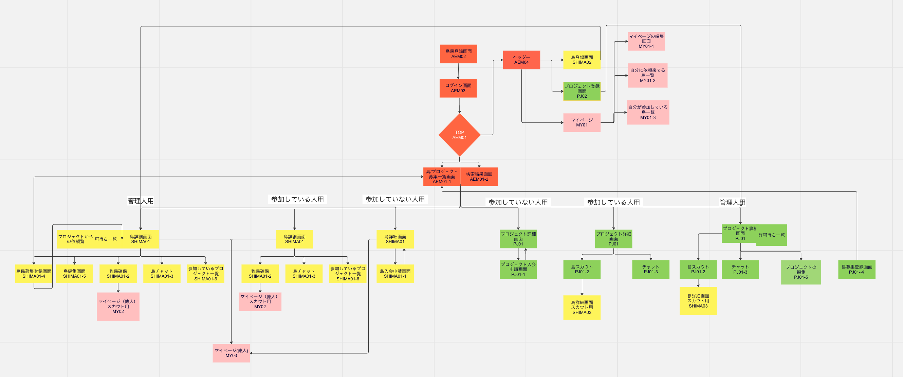

# AtsumareEngineerNoMori

## 環境構築

```sh
npm install
```

### Webサーバー起動

```sh
npm run dev
```

### モックサーバー起動

```sh
npm run mock-api
```

## 概要
* ログイン、ユーザー登録、ユーザー同士のやりとりが出来るシステムの新規開発                                                                                  * 仮想の島やプロジェクトに所属し、依頼やスカウト・チャットなどができる。
    * 島やプロジェクトの作成者は管理人になり、入ってくる人の承認や解散の権利を持つ 

## 画面遷移図

